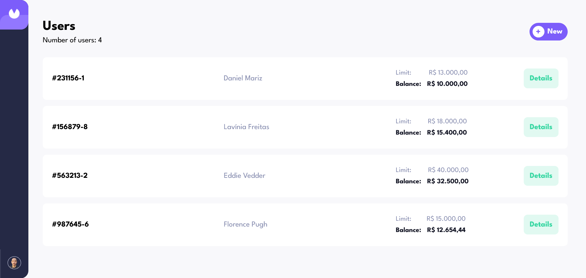

# Projeto Fullstack com Java 17, Spring Boot 3 e Angular - Dio Decola Tech 2025

Desafio de projeto proposto no módulo de `Desenvolvimento de APIs REST com Spring Framework`.

## Tabela de conteúdos

- [Overview](#overview)
  - [O projeto](#o-projeto)
  - [Screenshot](#screenshot)
  - [Links](#links)
- [Processo](#processo)
  - [Tech Stack](#tech-stack)
- [Autor](#autor)

## Overview

### O projeto

Os usuários desse projeto devem ser capazes de:

- Visualizar a lista completa de usuários cadastrados no banco de dados;
- Editar um usuário existente;
- Cadastrar um novo usuário;
- Excluir um usuário;
- Ver informações detalhadas de um usuário ao clicar no botão `Details`;
- Receber mensagens de confirmação finalizar a criação, edição ou exclusão de um usuário;
- Receber mensagens de erro ao preencher os campos do formulário de cadastro/edição incorretamente;
- Receber uma mensagem de erro ao tentar cadastrar um usuário com um número de conta já cadastrao anteriormente;
- Acessar a aplicação em dispositivos móveis ou desktop (Completamente responsivo).

### Screenshot

### Links

- Repositório do back-end: [Link](https://projeto-java-spring-boot-front.vercel.app)
- Link do deploy da aplicação: [Link](https://github.com/danielmrz-dev/projeto-java-springboot)

## Processo

### Tech Stack

- Angular
- Angular Material
- Reactive Forms
- SASS
- SASS Mixins
- Mobile-first workflow
- Ngx Mask
- RxJS

## Autor

- LinkedIn - [@danielmrz-dev](https://www.linkedin.com/in/danielmrz-dev/)
- Portfolio - [Link](https://danielmrz-portfolio.vercel.app/)
